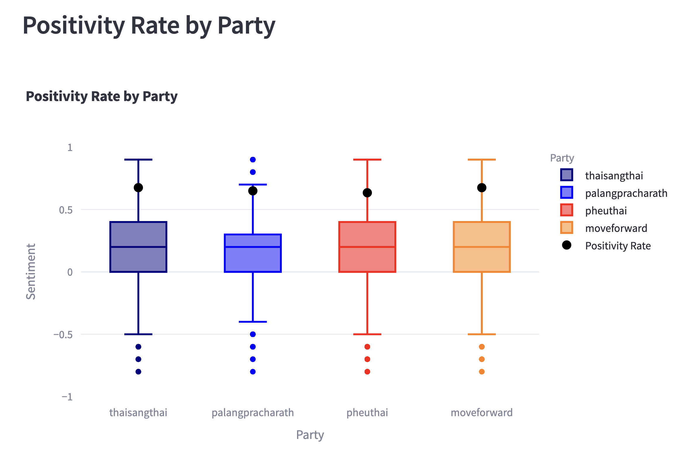
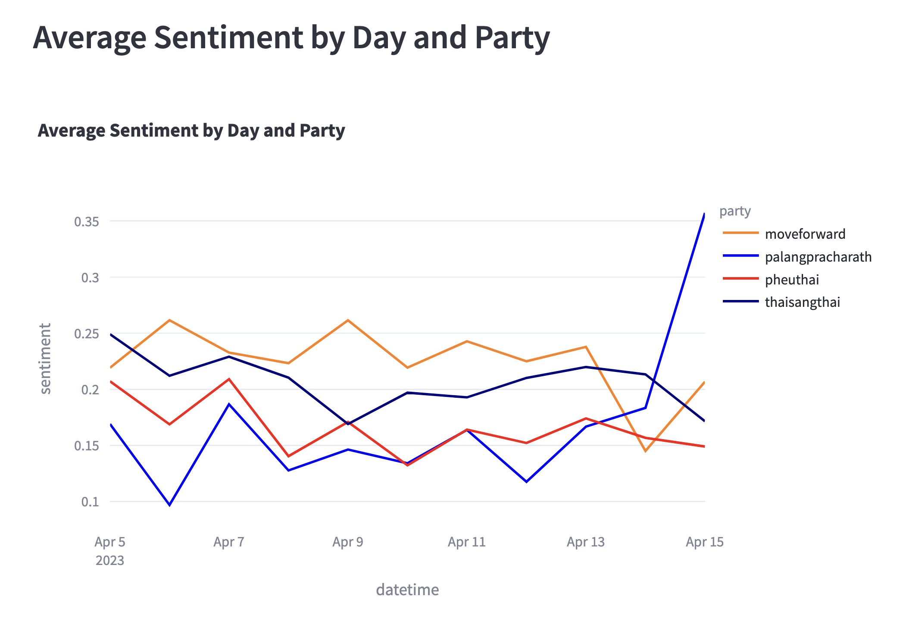
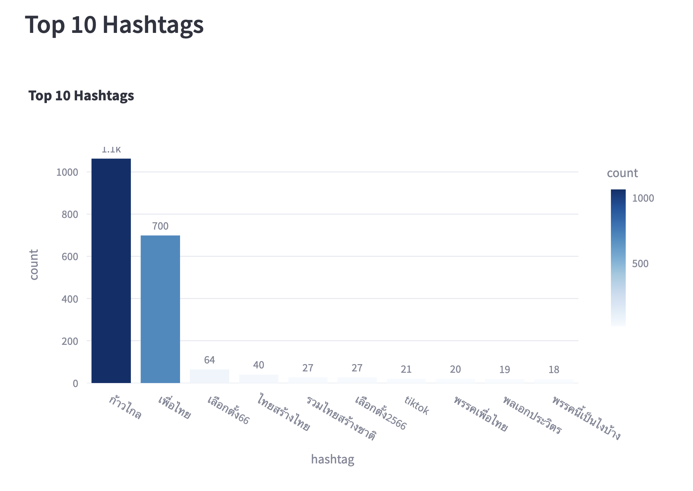
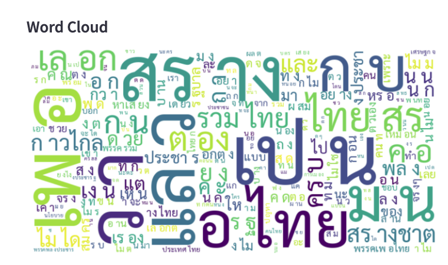
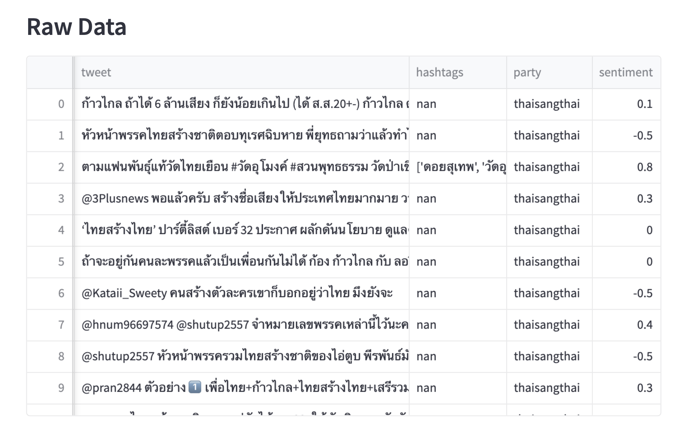

# Sentiment-Analysis-Application-with-Twitter-Thailand-election-2023

This project involved sentiment analysis of tweets using Twint, Google Cloud Natural Language API, and Kafka during the Thailand election 2023. 
The captured tweets were saved into Apache Druid for storage, and a chart was produced using Streamlit to summarize the overall sentiments.

# Screenshots

